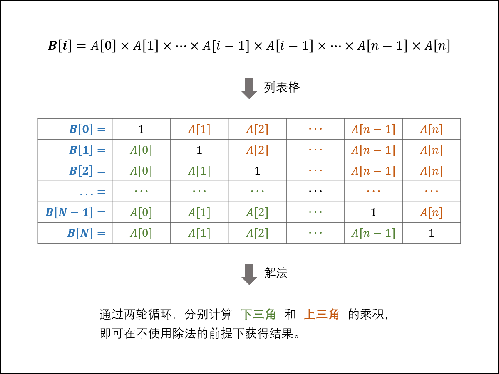

# easy

## 202-快乐数

```python
class Solution:
    def isHappy(self, n: int) -> bool:
        def sum(n):
            s = 0
            while n != 0:
                tmp = n % 10
                n = n // 10
                s += tmp**2
            return s
        d = {n}
        while n != 1:
            n = sum(n)
            if n in d:
                return False
            d.add(n)
        return True
```

## 121-买卖股票的最佳时机

只可买卖一次，选最低点到最高点

```python
class Solution:
    def maxProfit(self, prices: List[int]) -> int:
        minp, maxr = float('inf'), 0
        for price in prices:
            minp = min(minp, price)
            maxr = max(maxr, price-minp)
        return maxr
```

## 122-买卖股票2

可以买卖多次，所有上涨的相邻交易都买

```python
class Solution:
    def maxProfit(self, prices: List[int]) -> int:
        res = 0
        for i in range(1, len(prices)):
            subn = prices[i] - prices[i-1]
            if subn > 0:
                res += subn
        return res
```

## 714-买卖股票含手续费

买卖多次，所有上涨且够手续费的相邻交易都买

```python
class Solution:
    def maxProfit(self, prices: List[int], fee: int) -> int:
        minp, res = prices[0], 0
        for i in range(1, len(prices)):
            if prices[i] < minp:
                minp = prices[i]
            # 当前价格比最低价高但差价不足以支付手续费
            elif prices[i] - minp <= fee: 
                continue
            else: 
                res += prices[i] - minp - fee
                # 更新最小值（如果还在收获利润的区间里，表示并不是真正的卖出，而计算利润每次都要减去手续费，所以要让minp = prices[i] - fee，这样在明天收获利润的时候，才不会多减一次手续费！）
                minp = prices[i] - fee
        return res
```

## 415-字符串相加

```python
class Solution:
    def addStrings(self, num1: str, num2: str) -> str:
        i, j, add = len(num1)-1, len(num2)-1, 0
        res = ''
        while i >= 0 or j >= 0 or add != 0:
            if i >= 0:
                x = int(num1[i])
            else:
                x = 0
            if j >= 0:
                y = int(num2[j])
            else:
                y = 0
            tmp = x + y + add
            res = str(tmp%10) +res
            add = tmp // 10
            i -= 1
            j -= 1
        return res
```

## 155-最小栈

```python
class MinStack:
    def __init__(self):
        self.stack = []
    def push(self, x: int) -> None:
        if not self.stack:
            # 保存 (真实元素, 当前栈中最小元素) 即可
            self.stack.append((x, x))
        else:
            _, minn = self.stack[-1]
            if x < minn:
                self.stack.append((x, x))
            else:
                self.stack.append((x, minn))
    def pop(self) -> None:
        self.stack.pop(-1)
    def top(self) -> int:
        x, _ = self.stack[-1]
        return x
    def getMin(self) -> int:
        _, minn = self.stack[-1]
        return minn
```


# mid

## 912-排序

- 快排

```python
import random
class Solution:
    def sortArray(self, nums: List[int]) -> List[int]:
        def qsort(nums, l, r):
            if l >= r:
                return
            
            index = random.randint(l, r)
            nums[l], nums[index] = nums[index], nums[l]
            
            i, j = l, r
            tmp = nums[i]
            while i < j:
                while i < j and nums[j] >= tmp:
                    j -= 1
                nums[i] = nums[j]
                while i < j and nums[i] <= tmp:
                    i += 1
                nums[j] = nums[i]
            nums[i] = tmp
            
            qsort(nums, l, i-1)
            qsort(nums, i+1, r)
            
        qsort(nums, 0, len(nums)-1)
        return nums
```

- 堆排

```python
class Solution:
    def sortArray(self, nums: List[int]) -> List[int]:
        def heapifymax(nums, root, lens):
            p = root
            while p*2+1 < lens:
                l, r = p*2+1, p*2+2
                if r >= lens or nums[r] <= nums[l]:
                    nex = l
                else:
                    nex = r
                if nums[nex] > nums[p]:
                    nums[nex], nums[p] = nums[p], nums[nex]
                    p = nex
                else:
                    break

        for i in range((len(nums)-2)//2, -1, -1):
            heapifymax(nums, i, len(nums))
        
        for i in range(len(nums)-1, -1, -1):
            nums[0], nums[i] = nums[i], nums[0]
            heapifymax(nums, 0, i)
        return nums
```

- 归并

```python
class Solution:
    def sortArray(self, nums: List[int]) -> List[int]:
        def mergesort(nums, l, r):
            if l == r:
                return
            mid = (r + l) // 2
            mergesort(nums, l, mid)
            mergesort(nums, mid+1, r)
            i, j = l, mid+1
            tmp = []
            while i <= mid and j <= r:
                if nums[i] <= nums[j]:
                    tmp.append(nums[i])
                    i += 1
                else:
                    tmp.append(nums[j])
                    j += 1
            if i > mid:
                tmp.extend(nums[j:r+1])
            elif j > r:
                tmp.extend(nums[i:mid+1])
            nums[l:r+1] = tmp
            return

        mergesort(nums, 0, len(nums)-1)
        return nums
```

## 31-下一个排列

```python
class Solution:
    def nextPermutation(self, nums: List[int]) -> None:
        i = len(nums) - 2
        while i >= 0 and nums[i] >= nums[i+1]:
            i -= 1
        if i >= 0:
            j = len(nums) - 1
            while j >= 0 and nums[j] <= nums[i]:
                j -= 1
            nums[i], nums[j] = nums[j], nums[i]
        l, r = i + 1, len(nums) - 1
        while l < r:
            nums[l], nums[r] = nums[r], nums[l]
            l += 1
            r -= 1
        return
```

## 98-验证二叉搜索树

```python
class Solution:
    def isValidBST(self, root: TreeNode) -> bool:
        pre = -2**32
        def dfs(node):
            nonlocal pre
            if not node:
                return True
            if not dfs(node.left):
                return False
            if node.val <= pre:
                return False
            pre = node.val
            return dfs(node.right)
        return dfs(root)

```

## 148-排序链表

```python
class Solution:
    def sortList(self, head: Optional[ListNode]) -> Optional[ListNode]:
        def merge(head1, head2):
            vh = ListNode()
            t, i, j = vh, head1, head2
            while i and j:
                if i.val <= j.val:
                    t.next = i
                    i = i.next
                else:
                    t.next = j
                    j = j.next
                t = t.next
            if i:
                t.next = i
            else:
                t.next = j
            return vh.next
        def sort(head):
            if not head or not head.next:
                return head
            slow = fast = head
            while fast.next and fast.next.next:
                slow = slow.next
                fast = fast.next.next 
            nex = slow.next
            slow.next = None
            return merge(sort(head), sort(nex))
        return sort(head)
```

## 101-对称二叉树

```python
from collections import deque
class Solution:
    def isSymmetric(self, root: TreeNode) -> bool:
        queue = deque([root.left, root.right])
        while queue:
            node1 = queue.popleft()
            node2 = queue.popleft()
            if not node1 and not node2:
                continue
            if not node1 or not node2 or node1.val != node2.val:
                return False
            queue.append(node1.left)
            queue.append(node2.right)
            queue.append(node1.right)
            queue.append(node2.left)
        return True
```

## 3-无重复字符的最长子串

```python
class Solution:
    def lengthOfLongestSubstring(self, s: str) -> int:
        flag = dict()
        i = j = res = tmp = 0
        while i < len(s) - res:
            while flag.get(s[j], False):
                flag[s[i]] = False
                tmp -= 1
                i += 1
            flag[s[j]] = True
            tmp += 1
            j += 1
            if tmp > res:
                res = tmp
        return res
```

## 66-构建乘积数组



```python
class Solution:
    def constructArr(self, a: List[int]) -> List[int]:
        b = [1] * len(a)
        tmp = 1
        for i in range(1, len(b)):
            tmp *= a[i-1]
            b[i] *= tmp
        tmp = 1
        for i in range(len(b)-2, -1, -1):
            tmp *= a[i+1]
            b[i] *= tmp
        return b
```

## 695-岛屿的最大面积

```python
class Solution:
    def maxAreaOfIsland(self, grid: List[List[int]]) -> int:
        def dfs(grid, x, y):
            # 超出边界或者到达海洋直接返回
            if not 0 <= x < len(grid) or not 0 <= y <len(grid[0]) or grid[x][y] == 0:
                return
            # 走过的岛屿变成海洋，避免重复查找
            grid[x][y] = 0
            # 探测面积+1
            self.area += 1
            # 向四个方向探测
            dfs(grid, x, y-1)
            dfs(grid, x, y+1)
            dfs(grid, x-1, y)
            dfs(grid, x+1, y)
            return
        maxn = 0
        for i in range(len(grid)):
            for j in range(len(grid[0])):
                # 每个岛屿单独计算面积
                self.area = 0
                dfs(grid, i, j)
                maxn = max(maxn, self.area)
        return maxn
```

## 200-岛屿数量

```python
from collections import deque
class Solution:
    def numIslands(self, grid: [[str]]) -> int:
        def bfs(i, j):
            queue = deque()
            queue.append((i, j))
            while queue:
                i, j = queue.popleft()
                if 0 <= i < len(grid) and 0 <= j < len(grid[0]) and grid[i][j] == '1':
                    grid[i][j] = '0'
                    queue.append((i+1, j))
                    queue.append((i-1, j))
                    queue.append((i, j-1))
                    queue.append((i, j+1))
        def dfs(i, j):
            if not 0 <= i < len(grid) or not 0 <= j < len(grid[0]) or grid[i][j] == '0':
                return
            grid[i][j] = '0'
            dfs(i-1, j)
            dfs(i+1, j)
            dfs(i, j-1)
            dfs(i, j+1)
            return
        count = 0
        for i in range(len(grid)):
            for j in range(len(grid[0])):
                if grid[i][j] == '1': 
                    dfs(i, j)
                    count += 1
        return count
```

## 8-字符串转换整数

```python
class Solution:
    def myAtoi(self, s: str) -> int:
        # 去掉首部空字符
        s = s.lstrip()
        if not s:
            return 0

        # 处理符号
        i = 0
        if s[i] == '-':
            flag = -1
            i += 1
        elif s[i] == '+':
            flag = 1
            i += 1
        else:
            flag = 1
        if i == len(s):
            return 0

        # 计算
        tmp = 0
        while i < len(s) and '0' <= s[i] <= '9':
            tmp = tmp * 10 + int(s[i])
            if tmp >= 2**31 - 1 and flag == 1:
                tmp = 2**31 - 1
                break
            if tmp >= 2**31 and flag == -1:
                tmp = 2**31
                break
            i += 1

        return tmp * flag
```

## 106-中序后序构造二叉树

```python
class Solution:
    def buildTree(self, inorder: List[int], postorder: List[int]) -> TreeNode:
        def dfs(ino, pos):
            if not pos:
                return None
            mid = pos[-1]
            index = ino.index(mid)
            node = TreeNode(mid)
            # 后序数组切割标准：最后一个不用，然后大小一定和中序数组长度相同
            node.left = dfs(ino[:index], pos[:index])
            node.right = dfs(ino[index+1:], pos[index:-1])
            return node
        return dfs(inorder, postorder)
```

## 300-最长递增子序列

```python
# nlogn做法
class Solution:
    def lengthOfLIS(self, nums: List[int]) -> int:
        d = []
        for num in nums:
            if not d or num > d[-1]:
                d.append(num)
            else:
                # 二分找到递增子序列中最佳替换位置进行替换
                l, r = 0, len(d) - 1
                loc = r
                while l <= r:
                    mid = (l + r) // 2
                    if num > d[mid]:
                        l = mid + 1
                    else:
                        loc = mid
                        r = mid - 1
                d[loc] = num
        return len(d)
# dp做法
class Solution:
    def lengthOfLIS(self, nums: List[int]) -> int:
        if not nums:
            return 0
        dp = [1] * len(nums)
        for i in range(len(nums)):
            for j in range(i):
                if nums[i] > nums[j]:
                    dp[i] = max(dp[i], dp[j] + 1)
        return max(dp)
```

## 19-删除链表倒数第N个节点

```python
class Solution:
    def removeNthFromEnd(self, head: ListNode, n: int) -> ListNode:
        vh = ListNode(next=head)
        i, j, k = vh, head, head
        for _ in range(n):
            k = k.next
        while k:
            k = k.next
            j = j.next
            i = i.next
        i.next = j.next
        return vh.next
```

## 498-对角线遍历

```python
class Solution:
    def findDiagonalOrder(self, mat: List[List[int]]) -> List[int]:
        m, n = len(mat), len(mat[0])
        res = []
        x = y = 0
        # 一共 m*n 个元素
        for i in range(m*n):
            res.append(mat[x][y])
            # 右上
            if (x+y) % 2 == 0:
                # 到达最右边，向下一个，到对角时优先向下，否则越界
                if y == n-1:
                    x += 1
                # 到达最上边，向右一个
                elif x == 0:
                    y += 1
                # 正常右上
                else:
                    x -= 1
                    y += 1
            # 左下
            else:
                if x == m-1:
                    y += 1
                elif y == 0:
                    x += 1
                else:
                    x += 1
                    y -= 1
        return res
```

## 46-全排列

```python
class Solution:
    def permute(self, nums: List[int]) -> List[List[int]]:
        res = []
        path = []
        used = [False for _ in range(len(nums))]
        def dfs(snum):
            if snum == len(nums):
                res.append(path.copy())
            for i in range(len(nums)):
                if used[i]:
                    continue
                used[i] = True
                path.append(nums[i])
                dfs(snum+1)
                path.pop(-1)
                used[i] = False
        dfs(0)
        return res
```

## 1306-跳跃游戏3

广度优先搜索，碰到0返回

```python
class Solution:
    def canReach(self, arr: List[int], start: int) -> bool:
        if arr[start] == 0:
            return True
        queue = collections.deque([start])
        used = {start}
        while len(queue):
            index = queue.popleft()
            for i in [index-arr[index], index+arr[index]]:
                if 0 <= i < len(arr) and i not in used:
                    if arr[i] == 0:
                        return True
                    queue.append(i)
                    used.add(i)
        return False
```

## 142-环形链表2

```python
class Solution:
    def detectCycle(self, head: ListNode) -> ListNode:
        f = l = head
        while True:
            if not f or not f.next or not f.next.next:
                return None
            f = f.next.next
            l = l.next
            if f == l:
                break
        f = head
        while True:
            if f == l:
                return l
            f = f.next
            l = l.next
```

## 215-第k个最大元素

第k大不需要堆，前k大用

```python
class Solution:
    def findKthLargest(self, nums: List[int], k: int) -> int:
        # 从大到小一趟快排
        def sort(l, r):
            tmp = nums[l]
            while l < r:
                while l < r and nums[r] <= tmp:
                    r -= 1
                nums[l] = nums[r]
                while l < r and nums[l] >= tmp:
                    l += 1
                nums[r] = nums[l]
            nums[l] = tmp
            return l
        l, r = 0, len(nums)-1
        while l <= r:
            mid = sort(l, r)
            if mid == k-1:
                return nums[mid]
            elif mid > k-1:
                r = mid - 1
            else:
                l = mid + 1
        return -1
```

## 718-最长重复子数组

这个必须是连续的，所以只有 a[i-1] == b[j-1] 的情况下，dp等于前一个状态+1

```python
class Solution:
    def findLength(self, A: List[int], B: List[int]) -> int:
        dp = [[0]*(len(B)+1) for _ in range(len(A)+1)]
        res = 0
        for i in range(1, len(A)+1):
            for j in range(1, len(B)+1):
                if A[i-1] == B[j-1]:
                    dp[i][j] = dp[i-1][j-1] + 1
                    if dp[i][j] > res:
                        res = dp[i][j]
        return res
```

## 5- 最长回文子串

```python
class Solution:
    def longestPalindrome(self, s: str) -> str:
        if len(s) < 2:
            return s
        maxlen = 1
        start = 0
        dp = [[False]*len(s) for _ in range(len(s))]
        for i in range(len(s)):
            dp[i][i] = True
        for l in range(2, len(s)+1):
            for i in range(len(s)):
                j = l - 1 + i
                if j > len(s) - 1:
                    break
                if s[i] == s[j] and (j - i  + 1 < 4 or dp[i+1][j-1]):
                    dp[i][j] = True
                if dp[i][j] and j - i + 1 > maxlen:
                    maxlen = j - i + 1
                    start = i
        return s[start:start+maxlen]
```


# hard

## 115-不同的子序列


```python
class Solution:
    def numDistinct(self, s: str, t: str) -> int:
        dp = [[0] * (len(s)+1) for _ in range(len(t)+1)]
        for i in range(len(s)+1):
            dp[0][i] = 1
        for i in range(1, len(t)+1):
            for j in range(i, len(s)+1):
                if t[i-1] == s[j-1]:
                    dp[i][j] = dp[i-1][j-1] + dp[i][j-1]
                else:
                    dp[i][j] = dp[i][j-1]
        return dp[-1][-1]
```

## 123-买卖股票3

```python
class Solution:
    def maxProfit(self, prices: List[int]) -> int:
        # 只能交易两次，定义两组买卖变量
        buy1, sell1 = -float('inf'), 0
        buy2, sell2 = -float('inf'), 0
        for price in prices:
            buy1 = max(buy1, -price)
            sell1 = max(sell1, buy1+price)
            buy2 = max(buy2, sell1-price)
            sell2 = max(sell2, buy2+price)
        return sell2
```

## 188-买卖股票4

```python
class Solution:
    def maxProfit(self, k: int, prices: List[int]) -> int:
       #  交易 k 次，所以定义 k 组 buy 和 sell
        buys, sells = [-float('inf')] * (k+1), [0] * (k+1)
        for price in prices:
            for i in range(1, k+1):
                buys[i] = max(buys[i], sells[i-1]-price)
                sells[i] = max(sells[i], buys[i]+price)
        return sells[-1]
```

