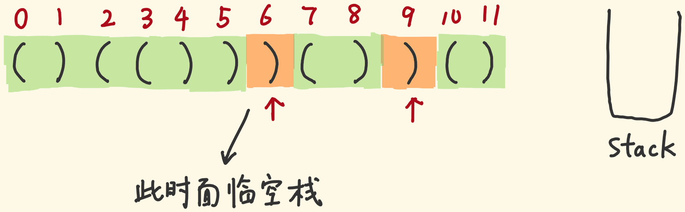
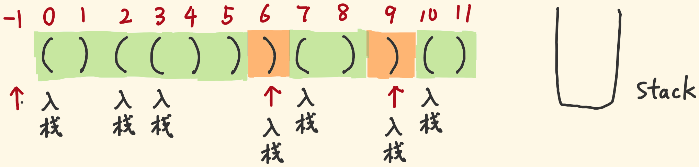
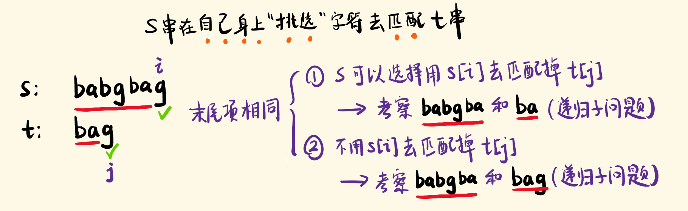
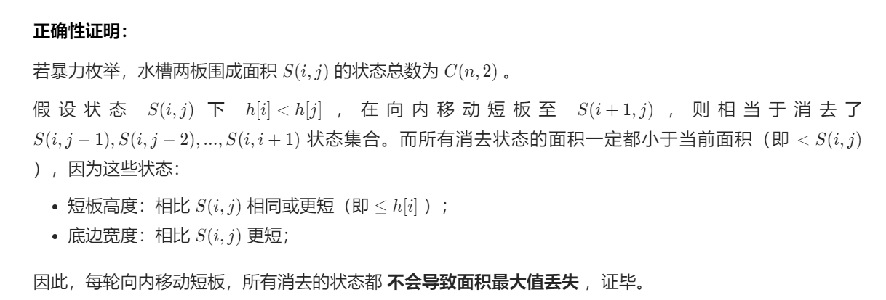
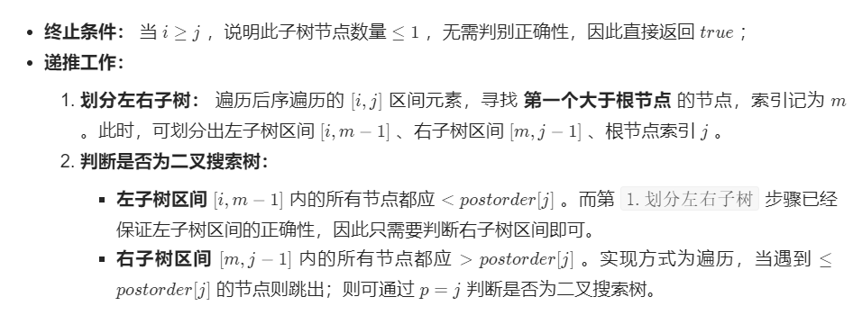
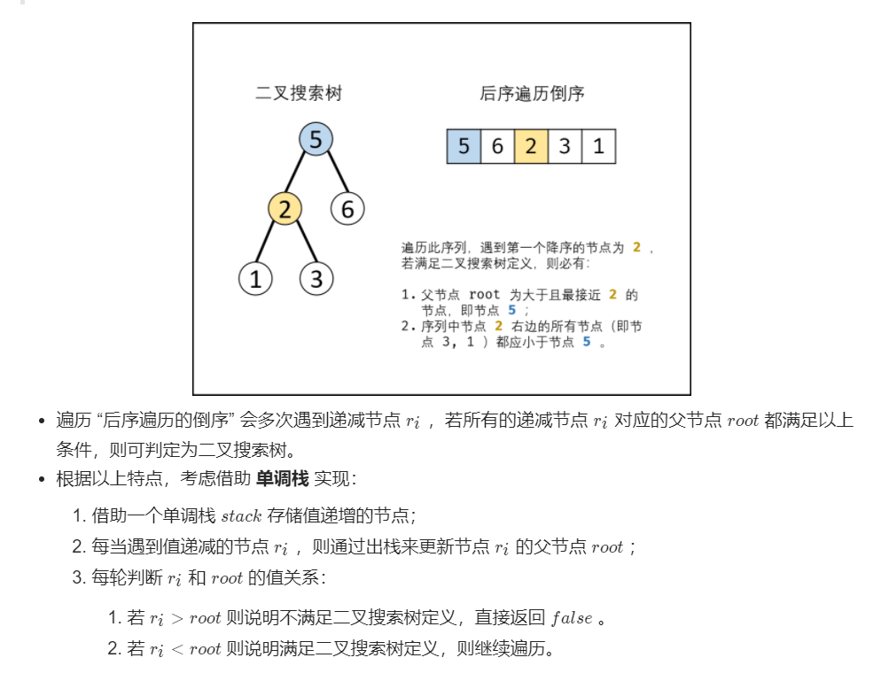

# 字符串

### 最长公共子序列（1143）

当前字符相等，则公共子序列长度+1

当前字符不相等，则公共子序列长度等于两个字符串各少一个与另一个的公共子序列长度中的最大值

```python
class Solution:
    def longestCommonSubsequence(self, str1: str, str2: str):
        dp = [[0]*(len(str2)+1) for _ in range(len(str1)+1)]
        for i in range(1, len(str1)+1):
            for j in range(1, len(str2)+1):
                if str1[i-1] == str2[j-1]:
                    dp[i][j] = dp[i-1][j-1] + 1
                else:
                    dp[i][j] = max(dp[i-1][j], dp[i][j-1])
        return dp[-1][-1]    # 如果只需要长度，直接返回即可

        # 倒序还原找到的公共子序列
        i, j = len(str1), len(str2)
        res = ''
        while i != 0 and j != 0:
            if str1[i-1] == str2[j-1]:
                res = str1[i-1] + res
                i -= 1
                j -= 1
            # 说明当时是由str1去掉一个字符选出来的
            elif dp[i-1][j] > dp[i][j-1]:
                i -= 1
            else:
                j -= 1
        return res
```

### 最长回文子串

```python
class Solution:
    def longestPalindrome(self, s: str) -> str:
        # 长度小于2直接返回
        if len(s) < 2:
            return s
        maxlen = 1
        start = 0
        # dp[i][j] 表示 s[i:j+1] 是否是回文串
        dp = [[False]*len(s) for _ in range(len(s))]
        # 单个字符一定是回文
        for i in range(len(s)):
            dp[i][i] = True
        # 枚举长度，每个长度判断所有可能的子串（i，j位置）
        for l in range(2, len(s)+1):
            for i in range(len(s)-l+1):
                j = i + l - 1
                # 长度为2时s[i]==s[j]即可，其他长度还要保证去掉首尾也是回文串
                if s[i] == s[j] and (l == 2 or dp[i+1][j-1]):
                    dp[i][j] = True
                if dp[i][j] and l > maxlen:
                    maxlen = l
                    start = i
        return s[start:start+maxlen]
```

### 最长有效括号（32）

- dp做法

```python
class Solution(object):
    def longestValidParentheses(self, s):
        if len(s) == 0:
            return 0
        dp = [0] * len(s)
        res = 0
        for i in range(1, len(s)):
        	#当遇到右括号时，尝试向前匹配左括号
            if s[i] == ')':
                if s[i-1] == '(':
                    if i-2 >= 0:
                        dp[i] = dp[i-2] + 2
                    else:
                        dp[i] = 2
                elif s[i-dp[i-1]-1] == '(':
                    if i-dp[i-1]-2 >= 0:
                        dp[i] = dp[i-1] + 2 + dp[i-dp[i-1]-2]
                    else:
                        dp[i] = dp[i-1] + 2
            res = max(res, dp[i])
        return res
```

- 栈做法





两种索引会入栈

1. 等待被匹配的左括号索引
2. 充当「参照物」的右括号索引，因为：当左括号匹配光时，栈需要留一个垫底的参照物，用于计算一段连续的有效长度

```python
class Solution:
    def longestValidParentheses(self, s: str) -> int:
        stack = [-1]
        res = 0
        for i in range(len(s)):
            if s[i] == '(':
                stack.append(i)
            else:
                stack.pop(-1)
                if not stack:
                    stack.append(i)
                res = max(res, i-stack[-1])
        return res
```

### 正则表达式匹配（19）

dp\[i][j] 表示 s 前 i 位和 p 前 j 位能否匹配

- i 或 j 可以表示空字符的状态，所以dp数组长度要比字符串长度大1

那么计算dp\[i][j]时首先看 p[j-1]：

- p[j-1] 不为 * ，只有以下两种情况可以匹配：
  - dp\[i-1][j-1] 且 p[j-1]\==s[i-1]，即 p 第 j 位和 s 第 i 位相等
  - dp\[i-1][j-1] 且 p[j-1]=='.' ，即 p 第 j 位为 . 可以随便与 s 第 i 位匹配
- p[j-1] 为 * ，只有以下三种情况可以匹配
  - dp\[i][j-2]，即认为 p[j-1] 和 p[j-2] 出现 0 次，看前面的是否匹配
  - dp\[i-1][j] 且 p[j-2]\==s[i-1]，即利用 * 让 p[j-2] 位多出现一次看是否与 s[i-1] 位匹配
  - dp\[i-1][j] 且 p[j-2]\=='.'，即利用 * 让前一位 . 多出现一次，随便匹配

初始化：

- s，p 都为空时是匹配的

- s 为空时 p 的偶数位必须都为 * 才能匹配
- p 为空时不能匹配

```python
def isMatch(self, s: str, p: str) -> bool:
    m, n = len(s), len(p)
    # 0表示空串，数组要长一位
    dp = [[False for _ in range(n+1)] for _ in range(m+1)]
    # 初始化
    dp[0][0] = True
    for i in range(2, n+1, 2):
        if dp[0][i-2] and p[i-1] == '*':
            dp[0][i] = True        
    for i in range(1, m+1):
        for j in range(1, n+1):
            # p[j-1] 不为 * 只有两种情况下可以匹配
            if p[j-1] != '*':
                if dp[i-1][j-1] and p[j-1] == s[i-1]:
                    dp[i][j] = True
                elif dp[i-1][j-1] and p[j-1] == '.':
                    dp[i][j] = True
            # p[j-1] 为 *，则有三种情况
            else:
                if dp[i][j-2]:
                    dp[i][j] = True
                elif dp[i-1][j] and p[j-2] == s[i-1]:
                    dp[i][j] = True
                elif dp[i-1][j] and p[j-2] == '.':
                    dp[i][j] = True
    return dp[-1][-1]
```

### 子序列个数



```python
class Solution:
    def numDistinct(self, s: str, t: str) -> int:
        dp = [[0] * (len(t)+1) for _ in range(len(s)+1)]
        for i in range(len(s)+1):
            dp[i][0] = 1
        for i in range(1, len(s)+1):
            for j in range(1, len(t)+1):
                if s[i-1] == t[j-1]:
                    dp[i][j] = dp[i-1][j-1] + dp[i-1][j]
                else:
                    dp[i][j] = dp[i-1][j]
        return dp[-1][-1]
```

# 数组

### 1-n中没有出现的数字（448）

当前数字不在它该在的位置并且它该在的位置上的数和它不一样时：不断和它该在的位置处的数字进行交换

```python
class Solution:
    def findDisappearedNumbers(self, nums: List[int]) -> List[int]:
        for i in range(len(nums)):
            while nums[i] != nums[nums[i]-1]:
                # 这里顺序不能反，py交换是先固定右边，然后左边依次赋值，先赋值nums[i]会影响nums[nums[i]-1]
                nums[nums[i]-1], nums[i] = nums[i], nums[nums[i]-1]
        return [i+1 for i in range(len(nums)) if nums[i] != i+1]
```

### 接雨水（42）

最暴力的想法，对于每一个位置，它左边最高的柱子和右边最高的柱子中较低的那一个比自己高出来的部分就是当前位置可以接到的雨水，累加每一个位置即可得到答案

但每个位置都要向左向右计算最高柱子显然是不行的，可以先预处理两遍，从左到右得到左侧最高位置数组，再从右往左得到右侧最高位置数组，最后再累加一遍得到答案

可以用单调栈来跟踪可能储水的最长的条形块，在遍历时维护一个栈，如果当前的条形块小于或等于栈顶的条形块，我们将条形块的索引入栈，意思是当前的条形块被栈中的前一个条形块界定，如果我们发现一个条形块长于栈顶，我们可以确定栈顶的条形块被当前条形块和栈的前一个条形块界定，因此我们可以弹出栈顶元素并且累加答案

```python
class Solution:
    def trap(self, height: List[int]) -> int:
        stack = []
        res = 0
        for i, h in enumerate(height):
            # 当前高度大于栈顶时，出栈一个计算一层
            while stack and h > height[stack[-1]]:
                # 栈顶一定比当前高度和栈里面一个高度都小，因为小于栈顶时直接入栈
                top = stack.pop()
                # 如果取出后栈空了，直接跳出while入栈，说明当前位置以前都不能装水
                if not stack:
                    break
                left = stack[-1]
                cw = i - left - 1
                ch = min(height[left], h) - height[top]
                res += cw * ch
            stack.append(i)
        return res
```

### 盛最多水的容器（11）

和接雨水不一样的地方在于柱子没有宽度，确定了两边的长度即可确定面积

- 可容纳水的高度由短板决定
- 在某个状态下，向中间收缩长板会导致：宽度-1，高度一定不会增加（短板效应），所以面积永远不会更大
- 而收缩短板，宽度-1，高度有可能增加，面积有可能更大
- 所以初始双指针指向两侧，每次向中间收缩短板指针，同时更新面积



```python
class Solution:
    def maxArea(self, height: List[int]) -> int:
        i, j, res = 0, len(height)-1, -float('inf')
        while i < j:
            res = max(res, (j-i)*min(height[i], height[j]))
            if height[i] >= height[j]:
                j -= 1
            else:
                i += 1
        return res
```

### 两个正序数组的中位数

```python
class Solution:
    def findMedianSortedArrays(self, nums1: List[int], nums2: List[int]) -> float:
        def getk(nums1, nums2, k):
            if len(nums1) > len(nums2):
                return getk(nums2, nums1, k)
            if len(nums1) == 0:
                return nums2[k-1]
            if k == 1:
                return min(nums1[0], nums2[0])
            m = k // 2 - 1
            i, j = min(len(nums1)-1, m), min(len(nums2)-1, m)
            if nums1[i] > nums2[j]:
                # nums1 i 之前的不能排除  4 5, 1 2 3 6, 找第4个，4不能排除
                return getk(nums1, nums2[j+1:], k-(j+1))
            return getk(nums1[i+1:], nums2, k-(i+1))

        k1, k2 = (len(nums1)+len(nums2)+1)//2, (len(nums1)+len(nums2)+2)//2
        return (getk(nums1, nums2, k1) + getk(nums1, nums2, k2)) / 2
            
```

### 第K大的数（215）

每次快排确定一个index，比较index与k的关系

```python
class Solution:
    def findKthLargest(self, nums: List[int], k: int) -> int:
        def sort(l, r):
            tmp = nums[l]
            while l < r:
                while l < r and nums[r] <= tmp:
                    r -= 1
                nums[l] = nums[r]
                while l < r and nums[l] >= tmp:
                    l += 1
                nums[r] = nums[l]
            nums[l] = tmp
            return l
        l, r = 0, len(nums)-1
        while l <= r:
            mid = sort(l, r)
            if mid == k-1:
                return nums[mid]
            elif mid > k-1:
                r = mid - 1
            else:
                l = mid + 1
        return -1
```

### 可被3整除的最大和（1262）

```python
class Solution:
    def maxSumDivThree(self, nums: List[int]) -> int:
        # dp[i][j] 表示前 i 个数，余数为 j 的最大和
        dp = [[-float('inf')]*3 for _ in range(len(nums)+1)]
        # 注意初始化，除了dp[0][0]，其他均初始化为负无穷，dp[i][1]和dp[i][2]在没有余1和2的数出现之前不能随便更新，否则会向后传递错误的结果，如 [3,6]，如果初始化为0，则dp[1][1]和dp[1][2]在 max 运算之后变为0，dp[2][1]和dp[2][2]便会因为dp[1][1]+6和dp[1][2]+6变成6，而实际上并没有余1和余2的和出现
        dp[0][0] = 0
        for i in range(1, len(nums)+1):
            t = nums[i-1] % 3
            # 当前数余0，则dp[i][0]为前面余0的dp 和 直接加上当前数（仍然余0）取最大值
            if t == 0:
                dp[i][0] = max(dp[i-1][0], dp[i-1][0]+nums[i-1])
                dp[i][1] = max(dp[i-1][1], dp[i-1][1]+nums[i-1])
                dp[i][2] = max(dp[i-1][2], dp[i-1][2]+nums[i-1])
            elif t == 1:
                dp[i][0] = max(dp[i-1][0], dp[i-1][2]+nums[i-1])
                dp[i][1] = max(dp[i-1][1], dp[i-1][0]+nums[i-1])
                dp[i][2] = max(dp[i-1][2], dp[i-1][1]+nums[i-1])
            else:
                dp[i][0] = max(dp[i-1][0], dp[i-1][1]+nums[i-1])
                dp[i][1] = max(dp[i-1][1], dp[i-1][2]+nums[i-1])
                dp[i][2] = max(dp[i-1][2], dp[i-1][0]+nums[i-1])
        return dp[-1][0]
```

### 乘积最大子数组

imax, imin 代表前i-1个元素的最大，最小乘积，遇到负数，两极反转

```python
class Solution:
    def maxProduct(self, nums: List[int]) -> int:
        res = imax = imin = nums[0]
        for i in range(1, len(nums)):
            if nums[i] < 0:
                imax, imin = imin, imax
            imax = max(nums[i], nums[i]*imax)
            imin = min(nums[i], nums[i]*imin)
            res = max(res, imax)
        return res
```

### 最大宽度坡（i<j 且 A[i]<=A[j）

```python
class Solution:
    def maxWidthRamp(self, nums: List[int]) -> int:
        # 单调栈，从A[0]开始的严格递减序列下标
        stack = [0]
        for i, num in enumerate(nums):
            if num < nums[stack[-1]]:
                stack.append(i)
        res = 0
        # 从后往前遍历，栈顶比当前数小时构成一个坡度，不断出栈计算最大坡度
        for i in range(len(nums)-1, 0, -1):
            while stack and nums[i] >= nums[stack[-1]]:
                res = max(res, i - stack.pop(-1))
        return res
```


# 数学

### 求质数

```python
def is_prime(n):
    if n == 1:
        return False
    for i in range(2, int(math.sqrt(n))+1):
        if n % i == 0:
            return False
```

### 第n个丑数（49）

- i 指向的数只能乘2，j 只能乘3，k 只能乘 5
- 每次取三个数乘各自的因子后的最小值加入dp，同时每个乘积为最新dp的指针都 +1（去重）

```python
def nthUglyNumber(self, n: int) -> int:
        dp = [0] * n
        dp[0] = 1
        i = j = k = 0
        for x in range(1, n):
            u2, u3, u5 = dp[i]*2, dp[j]*3, dp[k]*5
            dp[x] = min(u2, u3, u5)
            if dp[x] == u2:
                i += 1
            if dp[x] == u3:
                j += 1
            if dp[x] == u5:
                k += 1
        return dp[-1]
```

### randX实现randY

- 如果 X>Y 

```python
# 如果 X 是 Y 的倍数
rand4() % 2 + 1 -> 均匀的 [1, 2]
# 如果 X 不是 Y 的倍数，拒绝掉多出来的部分直到剩下 Y 倍数的那一部分
# 例如 rand5 实现 rand2
while True:
    num = rand5()
    if num > 4:
        continue
    # num：[1, 4]
    # num % 2 + 1：[1, 2]
    return num % 2 + 1
```

- 如果 X<Y

```python
(randX() - 1) * Y + randY() ->  均匀的 [1, X*Y]
# 那么如果用 rand7 生成 rand10
while True:
    num = (rand7() - 1) * 7 + rand7() # [0, 7, 14, ..., 42] + [1, 2, ..., 7] = [1, 2, 3, ..., 48, 49]
    if num <= 40:
        return num % 10 + 1
# 如果 X*X 还是小于 Y 呢
# X*X 包装一层，继续 X*X*X ...
```

### 从 m 个数中等概率选择 n 个数

- 蓄水池法：前 n 个数直接放到结果集中，第 i 个数开始，以 n/i 的几率选择留下，然后随机替换结果集中的一个


### 下一个更大的排列

```python
class Solution:
    def nextGreaterElement(self, n: int) -> int:
        # 转换成字符数组
        strs = list(str(n))
        # 从后往前找到第一个下降的位置
        i = len(strs) - 1
        while i > 0 and strs[i-1] >= strs[i]:
            i -= 1
        if i == 0:
            return -1
        i -= 1
        # 从后往前找到第一个比下降位置大的数并交换
        j = len(strs) - 1
        while j > i and strs[j] <= strs[i]:
            j -= 1
        strs[i], strs[j] = strs[j], strs[i]
        # 下降位置后面的数一定是降序，将其变为升序，双指针交换
        i += 1
        j = len(strs) - 1
        while i < j:
            strs[i], strs[j] = strs[j], strs[i]
            i += 1
            j -= 1
        # 取结果
        res = 0
        for num in strs:
            res = res * 10 + int(num)
            if res > 2 ** 31 - 1:
                return -1
        return res
```

### 1~n中1的个数

- 将 n 写为 nxnx−1⋯ n2n1，将各位出现1的次数加起来，注意从后往前每次只关心当前位
- 将 n 按位分为三段，high，cur，low，cur为当前位
- 那么初始是个位，high为n//10，cur为n%10，low设为0，digit代表数位为1
- 那么每次向前，low+=cur*digit，cur=high%10，high//=10，digit\*=10
- cur 如果为 0，那么与low无关，接下来会降为9...1，一共high轮，所以有 high*digit 个1
- cur 如果为 1，除了降为0之后的情况外，low位减少都要带着这个1，要多 low+1 个1
- cur 如果大于1，除了降为0之后的情况外，它降为1时low位要经历完整的最大到最小，所以要多 digit 个1

```python
def countDigitOne(self, n: int) -> int:
    high, cur, low, digit = n // 10, n % 10, 0, 1
    res = 0
    while high != 0 or cur != 0:
        res += high * digit
        if cur == 1:
            res += low + 1
        elif cur != 0:
            res += digit
        low += cur * digit
        cur = high % 10
        high //= 10
        digit *= 10
    return res
```

### 数字序列中的某一位

```python
'''
    数字范围    数量   位数    占多少位
    1-9        9      1       9
    10-99      90     2       180
    100-999    900    3       2700
    1000-9999  9000   4       36000
'''
def findNthDigit(self, n: int) -> int:
    start = 1
    count = 9
    digit = 1
    while n > count:
        n -= count
        digit += 1
        start *= 10
        count = digit * start * 9
    num = start + (n-1) // digit
    return int(str(num)[(n-1) % digit])
```

### 约瑟夫环问题

- 假设我们知道了有 10 个人时，最终的胜利者位置为 i，那么下一轮 9 个人时，删掉一个人之后，下一个人成为队头，相当于所有人都往前移了 m 位（不是1位，因为起始位置变了），那么最终胜利者位置也前移了 m 位 i-m
- 那么反推，如果9个人时最终胜利者位置为 i，那么10个人时位置就后移m位 i+m，考虑越界，要 % 这一轮的人数 10
- 1个人时，胜利者位置为 0

```python
def lastRemaining(self, n: int, m: int) -> int:
    index = 0
    for i in range(2, n+1):
        index = (index + m) % i
    return index
```

### 时钟指针的夹角

```python
class Solution:
    def angleClock(self, hour: int, minutes: int) -> float:
        one_m = 6
        one_h = 30
        m = minutes * one_m
        h = (hour % 12 + minutes / 60) * one_h
        diff = abs(m-h)
        return min(diff, 360-diff)
```


# 链表

### 回文链表

```python
class Solution:
    def isPalindrome(self, head: ListNode) -> bool:
        def reverse(head):
            pre, cur = None, head
            while cur:
                tmp = cur.next
                cur.next = pre
                pre = cur
                cur = tmp
            return pre

        # 找到中间节点
        fast = low = head
        while fast and fast.next and fast.next.next:
            fast = fast.next.next
            low = low.next

        # 反转后半部分
        p = head
        q = tail = reverse(low.next)

        # 判断
        while p and q:
            if p.val != q.val:
                return False
            p = p.next
            q = q.next

        # 复原
        low.next = reverse(tail)
        return True
```

### K反链表

```python
class Solution:
    def reverseKGroup(self, head: ListNode, k: int) -> ListNode:
        def reverse(l, r):
            pre = r.next
            cur = l
            while pre != r:
                tmp = cur.next
                cur.next = pre
                pre = cur
                cur = tmp
        vh = ListNode(next=head)
        pre = vh
        p = vh.next
        while p:
            q = p
            for i in range(k-1):
                q = q.next
                if not q:
                    return vh.next
            reverse(p, q)
            pre.next = q
            pre = p
            p = p.next
        return vh.next
```

### 复杂链表的复制

- 可以用hash（dict）存储原节点和复制节点的映射，这样第二轮就可用 d[p].next = d.get(p.next) 和 d[p].random = d.get(p.random) 来构建连接
- 构建拼接链表，空间复杂度更低（o1）

```python
def copyRandomList(self, head: 'Node') -> 'Node':
    if not head:
        return None
    # 构建拼接节点
    p = head
    while p:
        node = Node(p.val, next = p.next)
        p.next = node
        p = node.next
    # 构建各新节点的 random 指向
    p = head
    while p:
        if p.random:
            p.next.random = p.random.next
        p = p.next.next
    # 拆分节点
    pre = head
    cur = head.next
    p = cur
    # 注意末尾
    while cur.next:
        pre.next = pre.next.next
        cur.next = cur.next.next
        pre, cur = pre.next, cur.next
    pre.next = None
    return p
```

# 树

### 二叉树中和为某一值的路径

```python
def pathSum(self, root: TreeNode, sum: int) -> List[List[int]]:
    # 先处理空树
    if not root:
        return []
    res = []
    path = []
    def dfs(node, sumn):
        # 每到一层先把节点值加进路径
        path.append(node.val)
        # 是否到叶子节点且满足条件
        if not node.left and not node.right and sumn+node.val == sum:
            res.append(path.copy())
            return
        if node.left:
            dfs(node.left, sumn+node.val)
            path.pop(-1)
        if node.right:
            dfs(node.right, sumn+node.val)
            path.pop(-1)
    dfs(root, 0)
    return res
```

### 序列化反序列化二叉树

- 按层构建，节点出队，构造节点的左孩子并入队，构造右孩子并入队

```python
from collections import deque
class Codec:
    # 序列化
    def serialize(self, root):
        """Encodes a tree to a single string.

        :type root: TreeNode
        :rtype: str
        """
        if not root:
            return ''
        res = []
        queue = deque([root])
        while queue:
            node = queue.popleft()
            if not node:
                res.append(None)
            else:
                res.append(node.val)
                queue.append(node.left)
                queue.append(node.right)
        # 去掉尾部None，不要用 not 判断，会把0也去掉
        while res[-1] == None:
            res.pop(-1)
        return str(res)
	# 反序列化
    def deserialize(self, data):
        """Decodes your encoded data to tree.

        :type data: str
        :rtype: TreeNode
        """
        # '[]'
        if len(data) < 3:
            return None
        data = data[1:-1].split(', ')
        l = []
        for i in data:
            if i == 'None':
                l.append(None)
            else:
                l.append(int(i))
        n = len(l)
        # 根节点
        root = TreeNode(l[0])
        i = 1
        # 层序
        queue = deque([root])
        while queue:
            node = queue.popleft()
            if i < n and l[i] != None:
                node.left = TreeNode(l[i])
                queue.append(node.left)
            i += 1
            if i < n and l[i] != None:
                node.right = TreeNode(l[i])
                queue.append(node.right)
            i += 1
        return root
```

### 后序序列是否是二叉搜索树

- 递归分治（on2）



```python
def verifyPostorder(self, postorder: [int]) -> bool:
    def dfs(i, j):
        if i >= j: 
            return True
        p = i
        while postorder[p] < postorder[j]: 
            p += 1
        m = p
        while postorder[p] > postorder[j]: 
            p += 1
        return p == j and dfs(i, m - 1) and dfs(m, j - 1)

    return dfs(0, len(postorder)-1)
```

- 单调栈法（on）



```python
def verifyPostorder(self, postorder: List[int]) -> bool:
    # 单调栈，存储 递增 序列
    stack = []
    # root 初始值为正无穷大，可把树的根节点看为此无穷大节点的左孩子
    root = float('inf')
    # 倒序遍历
    for i in range(len(postorder)-1, -1, -1):
        # ri大于root，不满足
        if postorder[i] > root:
            return False
        # 寻找大于且最接近 ri 的节点（在栈底，如果栈不空的话）
        while stack and stack[-1] > postorder[i]
            root = stack.pop(-1)
        # 当前节点入栈
        stack.append(postorder[i])
    return True
```

路径和等于target的数目

```python
from collections import defaultdict
class Solution:
    def pathSum(self, root: Optional[TreeNode], targetSum: int) -> int:
        # 前缀路径和，到根节点的路径和 -> 节点数量
        pre = defaultdict(int)
        pre[0] = 1
        def dfs(node, cur):
            if not node:
                return 0
            cur += node.val
            # 当前节点到根节点路径和为cur
            # 如果有节点到根节点的路径和为 cur-target，则当前节点到该节点路径和为 target
            res = pre[cur - targetSum]
            pre[cur] += 1
            res += dfs(node.left, cur)
            res += dfs(node.right, cur)
            pre[cur] -= 1
            return res
        return dfs(root, 0)
```


# 图

### 顺时针打印矩阵

- up，down，left，right 初始指向行列首尾
- 填完上边后up下移（+1），填完右边后right左移（-1）。。。直到 up>down 或 left>right，填充完毕
- 填数或者读都是一样道理

```python
def spiralOrder(self, matrix: List[List[int]]) -> List[int]:
    if len(matrix) == 0:
        return []
    if len(matrix[0]) == 0:
        return []
    res = []
    # 行首尾，列首尾
    up, down, left, right = 0, len(matrix)-1, 0, len(matrix[0])-1
    # 0上1右2下3左
    flag = 0
    while up <= down and left <= right:
        flag = flag % 4
        if flag == 0:
            for i in range(left, right+1):
                res.append(matrix[up][i])
            up += 1
        elif flag == 1:
            for i in range(up, down+1):
                res.append(matrix[i][right])
            right -= 1
        elif flag == 2:
            for i in range(right, left-1, -1):
                res.append(matrix[down][i])
            down -= 1
        else:
            for i in range(down, up-1, -1):
                res.append(matrix[i][left])
            left += 1
        flag += 1
    return res
```

# 位运算

### 0-n中每个数二进制1的个数

- i>>1 一定小于等于 i，所以 i>>1 的计数一定已经算过了
- 如果 i 最低位是0（可以判断奇偶，也可以和1与运算），则 i 中 1 的个数 和 i>>1 相同，否则等于 i>>1 的个数 +1

```python
class Solution:
    def countBits(self, n: int) -> List[int]:
        res = [0] * (n+1)
        for i in range(n+1):
            res[i] = res[i>>1] + (i & 1)
        return res
```

### 只出现一次的两个数

- 全员异或得到出现一次的两个数的异或值（出现两次的异或后抵消为0）
- 从低到高找到为1的位
- 用这一位区分，这一位为1的放一起，不为1的放一起，分别异或得到两个出现一次的数

```python
def singleNumbers(self, nums: List[int]) -> List[int]:
    tmp = 0
    for num in nums:
        tmp = tmp ^ num
    div = 1
    while div & tmp == 0:
        div = div << 1
    a, b = 0, 0
    for num in nums:
        if num & div:
            a = a ^ num
        else:
            b = b ^ num
    return [a, b]
```


# 其他

### LRU

```python
# 先来一个双向链表，最近使用的移到尾部，弹出的时候从头部弹出最近最久未被使用的
class Node:
    def __init__(self, key=0, value=0, pre=None, nex=None):
        self.key = key
        self.value = value
        self.pre = pre
        self.nex = nex
class List:
    def __init__(self):
        self.head = Node()
        self.tail = Node(pre=self.head)
        self.head.nex = self.tail
    def append(self, node):
        node.pre, node.nex = self.tail.pre, self.tail
        node.pre.nex = node.nex.pre = node
    def pop(self):
        node = self.head.nex
        self.head.nex, node.nex.pre = node.nex, self.head
        return node.key
    def movetail(self, node):
        pre, nex = node.pre, node.nex
        pre.nex, nex.pre = nex, pre
        self.append(node)

# 需要：1. hashmap 来进行 O1 读写，2.双向链表来进行插入删除
# dict value存 node 节点，删除时要同时删除 dict 中的记录，反向操作，所以链表节点还要存 key 值
class LRUCache:
    def __init__(self, capacity: int):
        self.li = List()
        self.mp = {}
        self.maxl = capacity
    def get(self, key: int) -> int:
        node = self.mp.get(key, None)
        if node:
            self.li.movetail(node)
            return node.value
        return -1
    def put(self, key: int, value: int) -> None:
        # 能查到的话先更新值再移动到尾部
        if key in self.mp.keys():
            node = self.mp[key]
            node.value = value
            self.li.movetail(node)
            self.mp[key] = node
            return
        # 如果容量已经满了，删除最旧的节点
        if len(self.mp) >= self.maxl:
            del self.mp[self.li.pop()]
        node = Node(key, value)
        self.li.append(node)
        self.mp[key] = node
```
